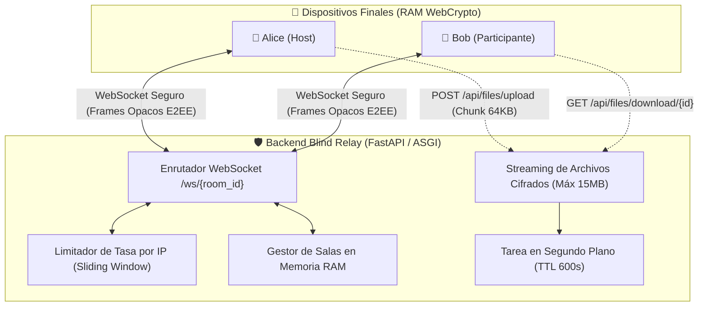

<div align="center">

# 🛡️ Chat Anónimo — Backend (Zero-Knowledge Blind Relay v2.5)
### Enrutador Ciego de Paquetes Asíncrono de Alto Rendimiento en FastAPI + WebSockets + Memoria RAM Volátil


**Enrutador ciego de paquetes criptográficos diseñado bajo el principio matemático de Incapacidad Técnica del Servidor (*Server Technical Inability*).**  
*El servidor no puede espiar, no almacena claves, no guarda historial y no conoce la identidad de los interlocutores.*

[🏠 Repositorio Umbrella](https://github.com/h3n-x/chat-anonimo) • [🎨 Repositorio Frontend](https://github.com/h3n-x/chat-frontend) • [🌐 Demo en Vivo](https://chat-zk.netlify.app)

</div>

---

## 🎯 ¿Por qué este Blind Relay es diferente?

En las arquitecturas de mensajería convencionales (como WhatsApp, Slack, Teams o Telegram):
* El servidor actúa como una **autoridad central de confianza** que valida sesiones, almacena perfiles de usuario, mantiene listas de contactos y conoce la clave pública permanente de cada individuo.
* Si el servidor es confiscado, vulnerado mediante un exploit zero-day o intervenido por un organismo gubernamental con una orden judicial, los operadores están obligados o capacitados para entregar los metadatos o interceptar las claves de sesión.

### La Filosofía de Chat Anónimo Backend:
El backend de Chat Anónimo fue diseñado para que **ni siquiera el propio desarrollador u operador del servidor pueda acceder al contenido de las comunicaciones**:
1. **Incapacidad Técnica Demostrable:** El servidor no dispone de código ni de claves para descifrar los paquetes de red. Todas las tramas WebSocket son sobres opacos (`ciphertext`, `iv`, `tag`, `AAD`).
2. **Cero Base de Datos:** No existe Postgres, ni MySQL, ni Redis, ni SQLite. Los descriptores de salas viven únicamente en diccionarios en la memoria RAM del proceso FastAPI y se destruyen de forma inmediata cuando los participantes se desconectan.
3. **Cero Logs de Metadatos:** Se desactivan los registros de acceso que asocien direcciones IP con mensajes o salas.
4. **Streaming Efímero de Archivos:** Las cargas binarias se almacenan temporalmente como blobs `.enc` cifrados en streaming con un límite estricto de **15 MB**. Un recolector de basura asíncrono los elimina irreversiblemente tras **600 segundos (10 minutos)**.

---

## 🏛️ Arquitectura del Servidor



---

## 🛡️ Límites del Modelo de Amenazas (Threat Model)

### Lo que este backend SÍ garantiza:
* **Incapacidad de Descifrado:** Si un atacante compromete el servidor o dumpea la memoria del proceso FastAPI, **no encontrará texto plano ni claves de descifrado**. Esto está garantizado por la prueba automatizada `tests/test_server_inability.py`.
* **Protección contra Spoofing y Replay entre Salas:** Cada trama incluye Datos Asociados Autenticados (`AAD = "room:XYZ"`). Si un atacante captura una trama cifrada de una sala y la inyecta en otra, el cliente receptor la descartará inmediatamente por fallo en la verificación del tag AES-GCM.
* **Resistencia a Denegación de Servicio (DoS):** Rate limiting deslizante en memoria que limita la creación de salas (10/min por IP), subida de archivos (3/min por IP) y mensajes WebSocket (30/min por conexión).
* **Consumo de Memoria Acotado:** Las subidas de archivos se procesan en streaming con chunks de 64 KB y corte inmediato con código `HTTP 413 Content Too Large` si se exceden los 15 MB.

### Lo que este backend NO protege:
* **Análisis de Tráfico a Nivel de ISP:** Un proveedor de internet o un observador global de red puede inferir la existencia de una conexión WebSocket entre dos direcciones IP y medir el volumen de datos (aunque no pueda leer el contenido). *Mitigación recomendada: utilizar Tor Browser o activar el Camuflaje de Tráfico Señuelo desde la interfaz.*
* **Endpoints Locales Comprometidos:** Si el dispositivo de Alice o Bob tiene un troyano, keylogger o extensión maliciosa, la información se compromete antes de llegar a la red.

---

## 🔌 Especificación de la API

### Endpoints REST

| Método | Ruta | Descripción | Límite de Tasa |
|---|---|---|---|
| `GET` | `/health` | Estado del servidor y recuento de salas activas en RAM | Sin límite |
| `POST` | `/api/rooms/create` | Genera un código de sala seguro de 6 caracteres | 10 / min por IP |
| `GET` | `/api/rooms/{room_id}/status` | Devuelve el número de participantes en la sala | 60 / min por IP |
| `POST` | `/api/files/upload` | Streaming de payload binario cifrado (máx. 15 MB) | 3 / min por IP |
| `GET` | `/api/files/download/{file_id}` | Descarga de payload `.enc` con cabecera `Cache-Control: no-store` | 30 / min por IP |

### Enrutador WebSocket (`/ws/{room_id}`)

El socket opera como un bus de eventos ciego. Los mensajes se serializan en formato JSON validado por Pydantic v2:

* **`e2ee_message`:** Reenvía el paquete cifrado (`ciphertext`, `iv`, `tag`, `burn_ttl`) a todos los demás participantes de la sala.
* **`key_request` / `key_delivery`:** Reenvía el sobre criptográfico envuelto con ECDH durante el apretón de manos inicial.
* **`typing`:** Difunde el indicador efímero de escritura.
* **`ping` / `pong`:** Flujo keepalive que permite al cliente calcular el RTT de latencia en milisegundos.

---

## 🧪 Pruebas Unitarias Automatizadas (Pytest)

El backend cuenta con **28 pruebas unitarias y de integración** que validan exhaustivamente cada garantía de seguridad:

```bash
cd chat-backend
source .venv/bin/activate
pytest -v
```

### Resumen de Suites:
* `tests/test_blind_relay.py`: Enrutamiento ciego, aislamiento estricto de salas y eventos de conexión/desconexión.
* `tests/test_server_inability.py`: Demuestra formalmente que el servidor no puede descifrar tramas cifradas.
* `tests/test_rate_limiter.py`: Ventanas deslizantes, bloqueo de IPs abusivas y protección contra flooding.
* `tests/test_file_upload.py`: Límite de 15 MB, streaming en bloques y recolector de basura de 10 minutos.
* `tests/test_participant_lifecycle.py`: Destrucción instantánea de salas huérfanas en memoria RAM.
* `tests/test_rooms.py`: Validación de identificadores de sala seguros de 6 caracteres alfanuméricos.

---

## 🚀 Instalación y Despliegue

### Requisitos
* Python 3.12, 3.13 o 3.14
* Virtualenv

```bash
# 1. Crear entorno virtual
python3 -m venv .venv
source .venv/bin/activate

# 2. Instalar dependencias
pip install -r requirements.txt

# 3. Iniciar el servidor con Uvicorn
python main.py
```

El servidor estará activo en `http://localhost:8000`.

### Despliegue en Producción (Docker)
```bash
docker build -t chat-backend .
docker run -p 8000:8000 --memory=512m --cpus=1 chat-backend
```

---

## 📜 Licencia
Distribuido bajo la Licencia **MIT**.
